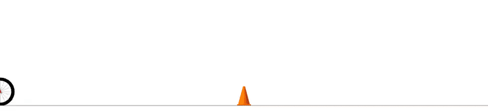

[](https://github.com/thowell/CALIPSO.jl/actions/workflows/CI.yml)
[](https://codecov.io/gh/thowell/CALIPSO.jl)

# CALIPSO.jl
Conic Augmented Lagrangian Interior-Point SOlver: A solver for contact-implicit trajectory optimization

The CALIPSO algorithm is an infeasible-start, primal-dual augmented-Lagrangian interior-point solver for non-convex optimization problems. 
An augmented Lagrangian is employed for equality constraints and cones are handled by interior-point methods.

## Standard form
Problems of the following form:

$$
\begin{align*}
\underset{x}{\text{minimize}} & \quad c(x; \theta) \\
\text{subject to} & \quad  g(x; \theta) = 0, \\
                  & \quad  h(x; \theta) \in \mathcal{K},
\end{align*}
$$

can be optimized for 

- $x$: decision variables 
- $\theta$: problem parameters 
- $\mathcal{K}$: Cartesian product of convex cones; nonnegative orthant $\mathbf{R}_+$ and second-order cones $\mathcal{Q}$ are currently implemented

## Trajectory optimization
Additionally, problem with temporal structure of the form:

$$ 
\begin{align*}
		\underset{X_{1:T}, \phantom{\,} U_{1:T-1}}{\mbox{minimize }} & C_T(X_T; \theta) + \sum \limits_{t = 1}^{T-1} C_t(X_t, U_t; \theta)\\
		\mbox{subject to } & F_t(X_t, U_t) = X_{t+1}, \quad t = 1,\dots,T-1,\\
		& E_t(X_t, U_t) = 0, \phantom{\, _{t+1}} \quad t = 1, \dots, T,\\
		& H_t(X_t, U_t) \in \mathcal{K}_t, \phantom{X} \quad t = 1, \dots, T,
\end{align*}
$$

are automatically formulated, and fast gradients generated, for CALIPSO.

## Solution gradients
The solver is differentiable, and gradients of the solution, including internal solver variables, $w = (x, y, z, r, s, t)$ :

$$ 
\partial w^*(\theta) / \partial \theta,
$$

with respect to the problem parameters are efficiently computed.

## Examples

### ball-in-cup
 

### bunny hop
 

### quadruped gait 
 

### cyberdrift 
 

### rocket landing with state-triggered constraints 

### cart-pole auto-tuning

### acrobot auto-tuning

## Quick start (non-convex problem)
```julia
using CALIPSO

# problem
objective(x) = x[1]
equality(x) = [x[1]^2 - x[2] - 1.0; x[1] - x[3] - 0.5]
cone(x) = x[2:3]

# variables 
num_variables = 3

# solver
solver = Solver(objective, equality, cone, num_variables);

# initialize
x0 = [-2.0, 3.0, 1.0]
initialize!(solver, x0)

# solve 
solve!(solver)

# solution 
solver.solution.variables # x* = [1.0, 0.0, 0.5]
```

## Quick start (pendulum swing-up)
```julia
using CALIPSO 
using LinearAlgebra 

# horizon 
horizon = 11 

# dimensions 
num_states = [2 for t = 1:horizon]
num_actions = [1 for t = 1:horizon-1] 

# dynamics
function pendulum_continuous(x, u)
   mass = 1.0
   length_com = 0.5
   gravity = 9.81
   damping = 0.1

   [
      x[2],
      (u[1] / ((mass * length_com * length_com))
            - gravity * sin(x[1]) / length_com
            - damping * x[2] / (mass * length_com * length_com))
   ]
end

function pendulum_discrete(y, x, u)
   h = 0.05 # timestep 
   y - (x + h * pendulum_continuous(0.5 * (x + y), u))
end

dynamics = [pendulum_discrete for t = 1:horizon-1] 

# states
state_initial = [0.0; 0.0] 
state_goal = [π; 0.0] 

# objective 
objective = [
   [(x, u) -> 0.1 * dot(x[1:2], x[1:2]) + 0.1 * dot(u, u) for t = 1:horizon-1]..., 
   (x, u) -> 0.1 * dot(x[1:2], x[1:2]),
];

# constraints 
equality = [
      (x, u) -> x - state_initial, 
      [empty_constraint for t = 2:horizon-1]..., 
      (x, u) -> x - state_goal,
];

# solver 
solver = Solver(objective, dynamics, num_states, num_actions; 
   equality=equality);

# initialize
state_guess = linear_interpolation(state_initial, state_goal, horizon)
action_guess = [1.0 * randn(num_actions[t]) for t = 1:horizon-1]
initialize_states!(solver, state_guess) 
initialize_controls!(solver, action_guess)

# solve 
solve!(solver)

# solution
state_solution, action_solution = get_trajectory(solver);
```


